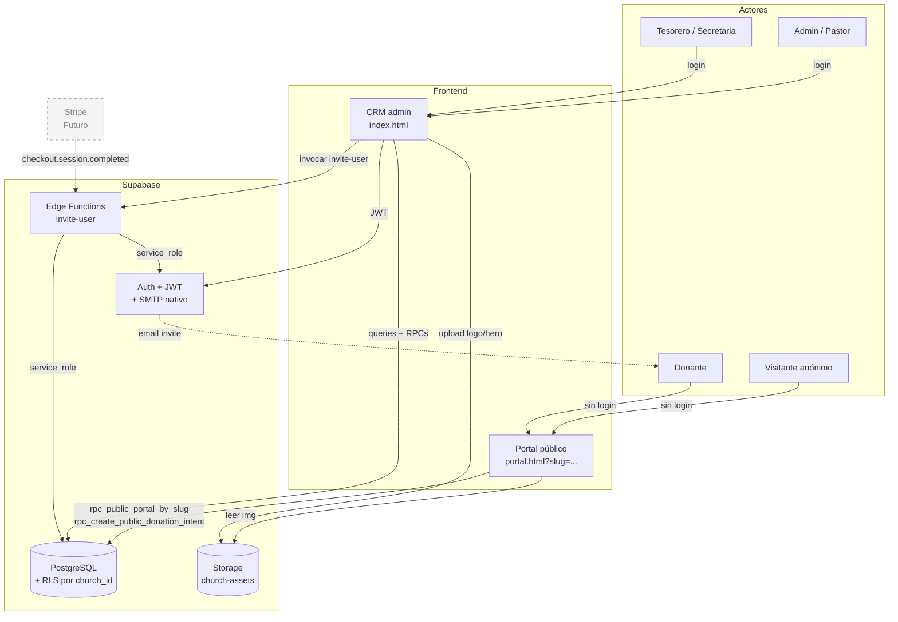
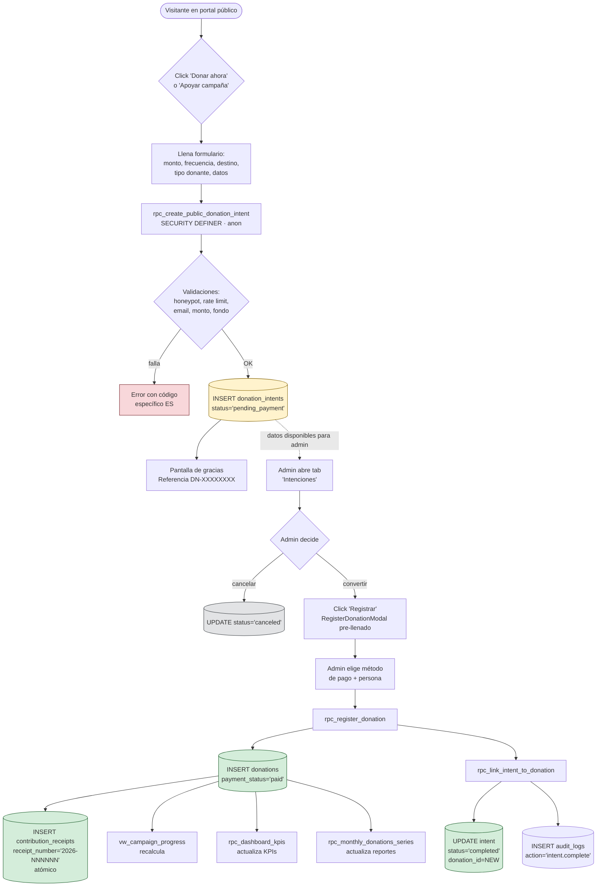
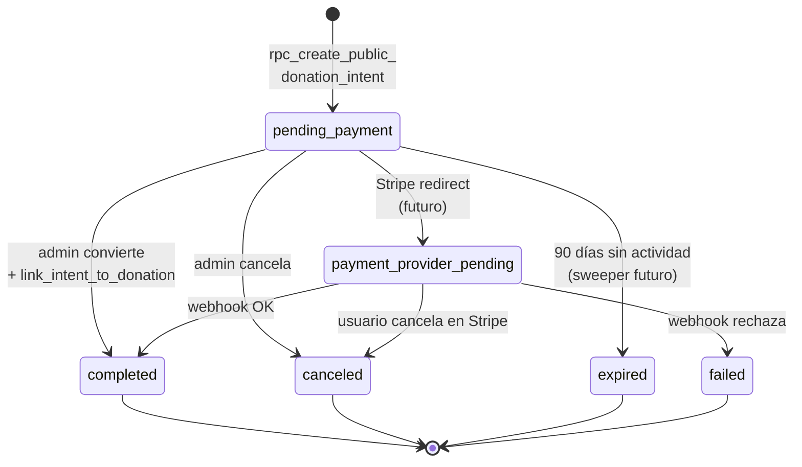
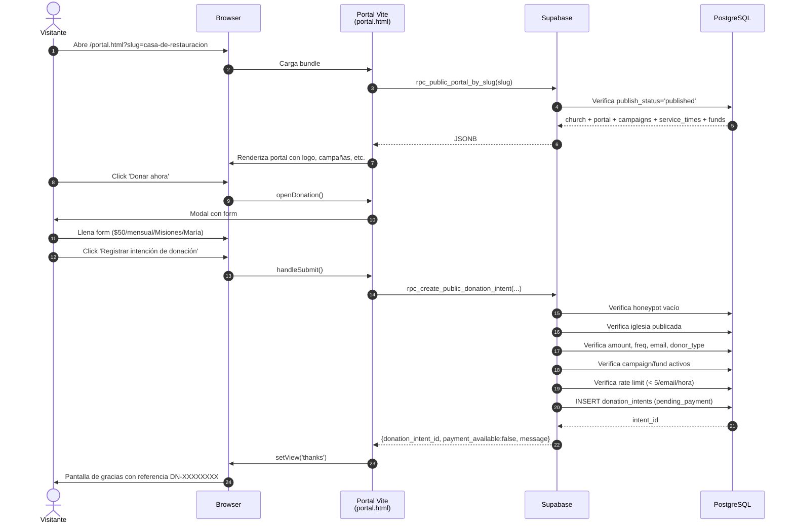
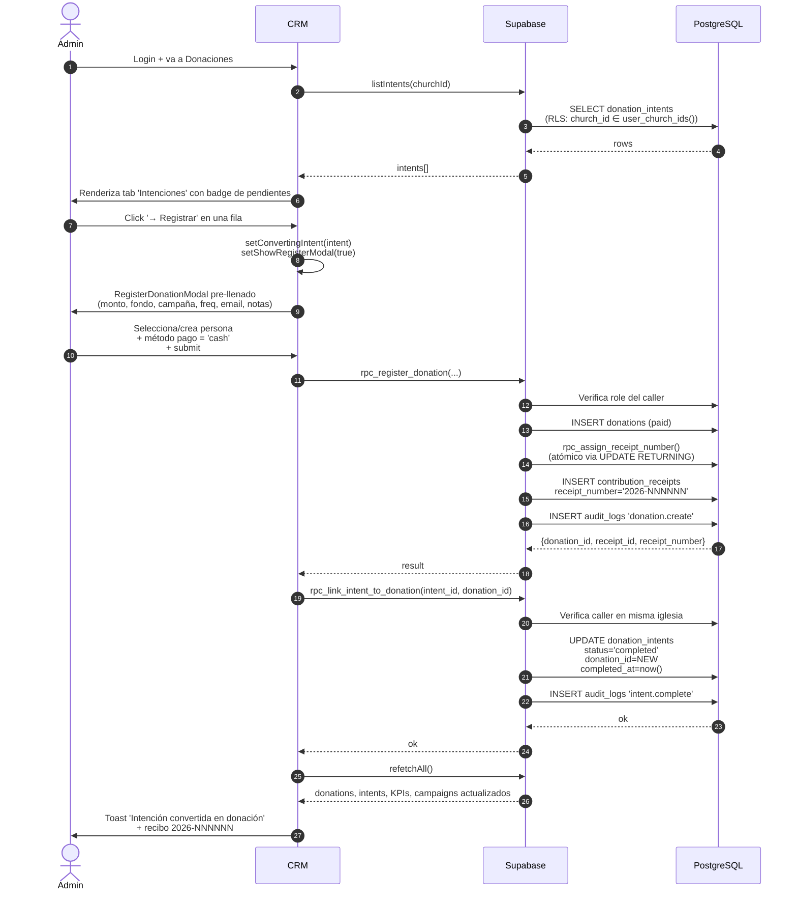
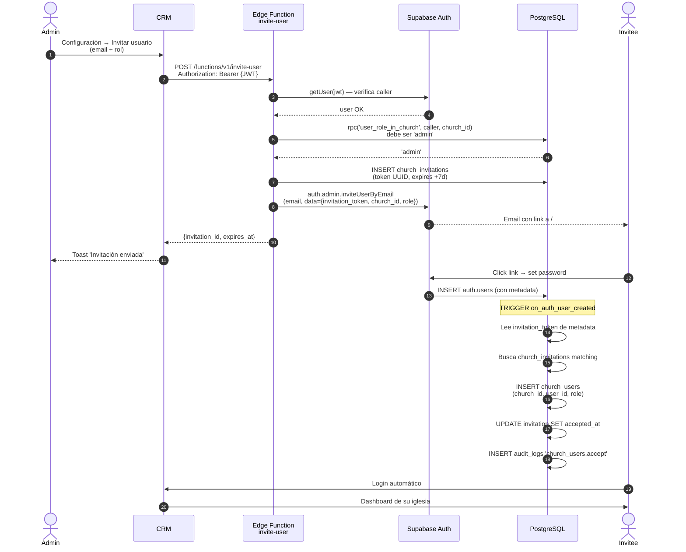
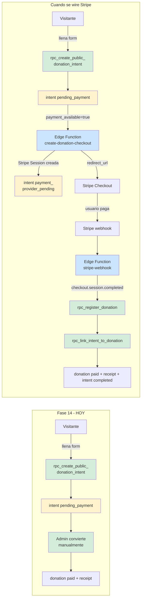

# SYSTEM_FLOW.md — Diagramas de proceso del Sistema de Iglesia

> Diagramas en formato Mermaid (renderizable en GitHub, GitLab, Notion, VS Code) y duplicados en ASCII para que cualquier visor los muestre.
>
> Cobertura:
> 1. Mapa general del sistema (actores + capas)
> 2. Pipeline de donación end-to-end (intent → donation → receipt)
> 3. Máquina de estados del `donation_intent`
> 4. Secuencia: visitante anónimo dona en el portal
> 5. Secuencia: admin convierte intent en donación
> 6. Secuencia: invitación de usuario
> 7. Wire de Stripe futuro (sin cambiar el flujo)

---

## 1. Mapa general del sistema

### Mermaid



### ASCII

```
┌─────────────────────────────────────────────────────────────────────┐
│  ACTORES                                                            │
│  ───────                                                            │
│  [Visitante anon]   [Donante]   [Admin/Pastor]   [Tesorero/Sec.]    │
│        │                │              │                │           │
│        │ sin login       │ sin login    │ login          │ login     │
└────────┼────────────────┼──────────────┼────────────────┼───────────┘
         │                │              │                │
         ▼                ▼              ▼                ▼
   ┌─────────────────────────┐  ┌──────────────────────────────┐
   │  Portal público         │  │  CRM admin                   │
   │  /portal.html?slug=...  │  │  /index.html                 │
   └────────┬────────────────┘  └────────┬─────────────────────┘
            │                            │
            │ rpc_public_portal_by_slug  │ JWT + RLS
            │ rpc_create_public_         │ + RPCs autenticadas
            │   donation_intent          │
            ▼                            ▼
   ┌─────────────────────────────────────────────────────────────┐
   │  SUPABASE                                                   │
   │  ──────                                                     │
   │  ┌──────────┐  ┌────────────────────┐  ┌─────────────────┐  │
   │  │ Auth     │  │ PostgreSQL         │  │ Storage         │  │
   │  │ + SMTP   │  │ + RLS por          │  │ church-assets   │  │
   │  │  nativo  │  │   church_id        │  │ (público)       │  │
   │  └────┬─────┘  └────────────────────┘  └─────────────────┘  │
   │       │                                                     │
   │  ┌────▼──────────────────┐                                  │
   │  │ Edge Functions        │                                  │
   │  │ invite-user           │                                  │
   │  └────┬──────────────────┘                                  │
   └───────┼─────────────────────────────────────────────────────┘
           │                              ┌───────────────────┐
           ▼ email invite                 │ Stripe (FUTURO)   │
       [Donante]                          │ webhook conectará │
                                          │ a Edge Function   │
                                          └───────────────────┘
```

---

## 2. Pipeline de donación end-to-end

El corazón del sistema. Muestra cómo una intención del público se transforma en donación confirmada con recibo fiscal, y cómo cada paso alimenta los reportes.

### Mermaid



### ASCII

```
                    ┌──────────────────────────────┐
                    │  Visitante en portal público │
                    └──────────────┬───────────────┘
                                   │
                                   ▼
                    ┌──────────────────────────────┐
                    │  Click "Donar ahora" o       │
                    │  "Apoyar esta campaña"       │
                    └──────────────┬───────────────┘
                                   │
                                   ▼
                    ┌──────────────────────────────┐
                    │  Form: monto · frecuencia ·  │
                    │  destino · tipo donante ·    │
                    │  datos                       │
                    └──────────────┬───────────────┘
                                   │
                                   ▼
              ┌─────────────────────────────────────────┐
              │  rpc_create_public_donation_intent       │
              │  (SECURITY DEFINER · anon)               │
              └────────────────┬─────────────────────────┘
                               │
            ┌──────────────────┴───────────────────┐
            │  Validaciones:                       │
            │   • honeypot                         │
            │   • rate limit (5/email/h)           │
            │   • email/monto/fondo/campaña        │
            └────────┬──────────────────────┬──────┘
                     │ falla                │ OK
                     ▼                      ▼
            ┌────────────────┐    ┌────────────────────────┐
            │ Error con      │    │ INSERT donation_intents│
            │ código ES      │    │ status='pending_payment'│  ◄── (PIPELINE INICIA)
            └────────────────┘    └───────────┬────────────┘
                                              │
                                              ▼
                                  ┌─────────────────────┐
                                  │ Pantalla de gracias │
                                  │ Ref: DN-XXXXXXXX    │
                                  └─────────────────────┘

═══════════════════════════════════════════════════════════════════════
   ADMIN abre tab "Intenciones" → decide qué hacer
═══════════════════════════════════════════════════════════════════════

                    ┌─────────────────────────────┐
                    │  Admin decide               │
                    └────┬────────────────────┬───┘
                         │                    │
                  cancelar                 convertir
                         │                    │
                         ▼                    ▼
              ┌──────────────────┐   ┌──────────────────────────┐
              │ UPDATE status=   │   │ RegisterDonationModal    │
              │ 'canceled'       │   │ pre-llenado:             │
              └──────────────────┘   │ • monto del intent       │
                                     │ • fondo del intent       │
                                     │ • campaña del intent     │
                                     │ • frecuencia             │
                                     │ • email en donor search  │
                                     └────────────┬─────────────┘
                                                  │
                                                  ▼
                                     ┌──────────────────────────┐
                                     │ Admin selecciona persona │
                                     │ y método de pago         │
                                     │ (efectivo/cheque/etc.)   │
                                     └────────────┬─────────────┘
                                                  │
                                                  ▼
                                     ┌──────────────────────────┐
                                     │ rpc_register_donation    │
                                     └────────────┬─────────────┘
                                                  │
                              ┌───────────────────┼───────────────────┐
                              ▼                   ▼                   ▼
                  ┌────────────────────┐ ┌─────────────────┐ ┌─────────────────┐
                  │ INSERT donations   │ │ rpc_assign_     │ │ INSERT          │
                  │ payment_status=    │ │ receipt_number  │ │ contribution_   │
                  │ 'paid'             │ │ atómico         │ │ receipts        │
                  └─────────┬──────────┘ └────────┬────────┘ │ '2026-NNNNNN'   │
                            │                    │          └────────┬────────┘
                            │                    └──────────────────►│
                            ▼                                        ▼
                  ┌───────────────────┐               ┌──────────────────────┐
                  │ rpc_link_intent_  │               │  INSERT audit_logs   │
                  │ to_donation       │               │  'intent.complete'   │
                  └─────────┬─────────┘               └──────────────────────┘
                            │
                            ▼
                  ┌───────────────────────────┐
                  │ UPDATE donation_intents   │
                  │ status='completed'        │
                  │ donation_id=NEW           │
                  │ completed_at=now()        │
                  └─────────┬─────────────────┘
                            │
              ┌─────────────┼──────────────┐
              ▼             ▼              ▼
   ┌───────────────┐ ┌──────────────┐ ┌──────────────────┐
   │ vw_campaign_  │ │ rpc_         │ │ rpc_monthly_     │
   │ progress      │ │ dashboard_   │ │ donations_       │
   │ (live recalc) │ │ kpis         │ │ series           │
   └───────────────┘ └──────────────┘ └──────────────────┘
                          (Reportes y Dashboard actualizados)
```

---

## 3. Máquina de estados del `donation_intent`

### Mermaid



### ASCII

```
            ┌─────────────────────┐
            │ rpc_create_public_  │
            │ donation_intent     │
            └──────────┬──────────┘
                       ▼
            ┌─────────────────────┐
            │  pending_payment    │
            └──┬──────┬──────┬─┬──┘
               │      │      │ │
   admin       │      │      │ └── 90 días sin actividad
   convierte   │      │      │     (sweeper futuro)
               │      │      │              │
               │      │      │              ▼
               │      │      │     ┌──────────┐
               │      │      │     │ expired  │
               │      │      │     └──────────┘
               │      │      │
   admin       │      │      └── Stripe redirect (futuro)
   cancela     │      │                  │
               │      │                  ▼
               │      │     ┌──────────────────────────┐
               │      │     │ payment_provider_pending │
               │      │     └─────┬────────┬───────────┘
               │      │           │        │
               │      │   webhook │        │ webhook rechaza
               │      │   OK      │        │
               │      │           ▼        ▼
               │      │   ┌──────────┐ ┌────────┐
               │      │   │completed │ │ failed │
               │      │   └──────────┘ └────────┘
               │      │
               │      ▼
               │   ┌──────────┐
               │   │ canceled │
               │   └──────────┘
               │
               ▼
        rpc_link_intent_to_donation
               │
               ▼
        ┌──────────────┐
        │  completed   │   ← donation_id set
        │              │     + audit log
        └──────────────┘
```

---

## 4. Secuencia: visitante dona en el portal

### Mermaid



### ASCII

```
 Visitante       Browser         Portal Vite       Supabase         PostgreSQL
 ─────────       ───────         ───────────       ────────         ──────────
     │              │                  │              │                 │
     │  Abre URL    │                  │              │                 │
     ├─────────────►│                  │              │                 │
     │              │  Carga bundle    │              │                 │
     │              ├─────────────────►│              │                 │
     │              │                  │ rpc_public_  │                 │
     │              │                  │  portal_by_  │                 │
     │              │                  │  slug        │                 │
     │              │                  ├─────────────►│                 │
     │              │                  │              │ check published │
     │              │                  │              ├────────────────►│
     │              │                  │              │  church + data  │
     │              │                  │              │◄────────────────┤
     │              │                  │  JSONB       │                 │
     │              │                  │◄─────────────┤                 │
     │              │  Renderiza       │              │                 │
     │              │◄─────────────────┤              │                 │
     │              │                  │              │                 │
     │ Click Donar  │                  │              │                 │
     ├─────────────►│ openDonation()   │              │                 │
     │              ├─────────────────►│              │                 │
     │  Modal       │                  │              │                 │
     │◄──────────────────────────────────                              │
     │              │                  │              │                 │
     │ Llena + submit                  │              │                 │
     ├─────────────►│                  │              │                 │
     │              │ handleSubmit     │              │                 │
     │              ├─────────────────►│              │                 │
     │              │                  │ rpc_create_  │                 │
     │              │                  │  public_     │                 │
     │              │                  │  donation_   │                 │
     │              │                  │  intent      │                 │
     │              │                  ├─────────────►│                 │
     │              │                  │              │ honeypot?       │
     │              │                  │              │ rate limit?     │
     │              │                  │              │ email regex?    │
     │              │                  │              │ amount sanity?  │
     │              │                  │              │ campaign válida?│
     │              │                  │              │ INSERT intent   │
     │              │                  │              ├────────────────►│
     │              │                  │              │  intent_id      │
     │              │                  │              │◄────────────────┤
     │              │                  │  payload     │                 │
     │              │                  │◄─────────────┤                 │
     │              │  thanks view     │              │                 │
     │              │◄─────────────────┤              │                 │
     │ Gracias +    │                  │              │                 │
     │ DN-XXXXXXXX  │                  │              │                 │
     │◄─────────────┤                  │              │                 │
```

---

## 5. Secuencia: admin convierte intent a donation

### Mermaid



---

## 6. Secuencia: invitación de usuario

### Mermaid



---

## 7. Cómo Stripe se enchufa después (sin redesign)

### Mermaid



**Lo crítico**: la tabla `donation_intents`, las RPCs `rpc_register_donation` y `rpc_link_intent_to_donation` **no cambian**. Solo se agregan 2 Edge Functions y se activa el flag `payment_available`. **El frontend se redirige a Stripe en lugar de mostrar la pantalla de gracias offline** — el resto del sistema sigue igual.

---

## 8. Cómo usar estos diagramas

**Para el cliente (demo)**: mostrar en orden los diagramas 4 → 2 → 3 → 7. Es la narrativa "visitante → admin → reportes → futuro Stripe".

**Para onboarding técnico**: 1 → 5 → 6 → 3. Cubre arquitectura, flujos clave y máquina de estados.

**Para auditoría / seguridad**: 1 + 5 destacan el modelo multi-tenant y la cadena de audit_logs.

**Cómo renderizar**:
- GitHub / GitLab: pega el mermaid en un README — se renderiza nativo.
- Notion: bloque "Mermaid" o usa la versión ASCII.
- VS Code: extensión "Markdown Preview Mermaid Support".
- Web rápido: https://mermaid.live → pega el bloque y exporta PNG/SVG.

---

*Diagramas alineados al estado del sistema al cierre de Fase 14 (2026-05-30).*
